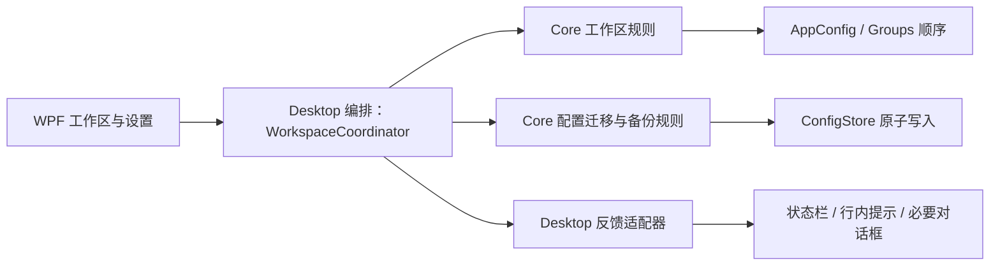

# P2：工作区体验完善——详细开发方案

- 文档状态：实施前基线
- 对应产品优先级：`Launcher-PRD.md` 的 **P2：工作区体验完善**；`docs/DEVELOPMENT-ROADMAP.md` 的 **R3：工作区体验与配置演进**
- 目标客户端：`native/LanFlow.Desktop`（WPF + .NET 8）
- 更新日期：2026-07-29
- 本轮边界：只定义可执行方案，不代表 P2 功能已经实现

## 1. 目标与完成定义

P2 的目标不是继续增加启动器入口，而是让已经整理过较多项目的用户可以稳定地维护工作区：分组可预测地排序，内容不会因视口溢出而不可达，网格和卡片模式的编辑能力一致；设置、热键、启动与配置故障会给出可理解的结果；旧配置在升级后仍可安全读取、迁移、保存与备份。

P2 完成时，用户应能观察到以下结果：

1. 在左侧或顶部导航中调整分组顺序，重启后顺序保持；
2. 分组标签和项目区域在内容超过可视范围时可通过鼠标滚轮、滚动条和键盘访问，不再依赖隐藏滚动区域；
3. 网格与卡片两种视图在编辑态具有同等的删除、右键管理、拖放、选择和启动保护规则；
4. 热键冲突、启动目标不可用、保存失败、配置迁移和备份结果有统一且可行动的反馈；
5. 旧版无版本号配置可升级到受控版本，分组、项目、主题、布局、热键和其他已存在设置不丢失；
6. 用户可从设置中看到配置位置，并显式创建完整配置备份；
7. 不改变 full/lite 两条发布通道及其更新资产规则。

## 2. 事实基线、推断与待确认项

### 2.1 已验证事实

| 主题 | 当前事实 | 代码依据 |
| --- | --- | --- |
| 分组排序 | 分组顺序由 `AppConfig.Groups` 的集合顺序表达；可创建、重命名、删除和切换分组，但没有分组拖拽排序实现。 | `native/LanFlow.Core/Models/AppConfig.cs`；`native/LanFlow.Desktop/MainWindow.xaml.cs` |
| 折叠字段 | `Group.Collapsed` 已保存到 JSON，但现有桌面代码未读取或写入该字段，因此没有可见的折叠行为。 | `native/LanFlow.Core/Models/AppConfig.cs`；全仓代码检索 |
| 视图模式 | `Settings.LayoutMode` 已支持 `tile` / `card`，设置预览会即时应用，重启后由 `ConfigStore.Normalize` 保持合法值。 | `native/LanFlow.Core/Models/AppConfig.cs`；`SettingsWindow.xaml.cs`；`MainWindow.xaml.cs`；`ConfigStore.cs` |
| 编辑态一致性 | 网格与卡片模板均已有编辑态删除按钮；项目右键、拖放排序、跨分组移动由 `MainWindow.xaml.cs` 处理。 | `native/LanFlow.Desktop/MainWindow.xaml`；`native/LanFlow.Desktop/MainWindow.xaml.cs` |
| 溢出风险 | 主项目 `ListBox` 与分组导航 `ScrollViewer` 显式隐藏滚动条；内容增长时缺少已定义的可达性合同。导入预览滚动问题已在独立窗口修复，不应把它当成主工作区的充分验证。 | `native/LanFlow.Desktop/MainWindow.xaml`；`native/LanFlow.Desktop/Views/ImportPreviewWindow.xaml` |
| 设置与反馈 | 成功信息大多写入 `MainViewModel.StatusText`，错误则分散使用 `MessageBox` 或状态栏文案；热键冲突会回退旧值，但提示出现在设置窗口关闭后。 | `MainViewModel.cs`；`MainWindow.xaml.cs`；`HotkeyService.cs` |
| 启动异常 | `LauncherService.Open(item.Path)` 失败时主窗口仅给出“无法启动项目”，没有目标、原因类别和下一步动作。 | `native/LanFlow.Desktop/Services/LauncherService.cs`；`MainWindow.xaml.cs` |
| 配置持久化 | 配置写入采用 `.tmp` 文件再覆盖原文件；读取 JSON 或 I/O 异常时会返回默认配置，尚无配置版本、迁移报告、备份或恢复入口。 | `native/LanFlow.Core/Services/ConfigStore.cs` |
| 测试基础 | 已有 `LanFlow.Core.Tests`，覆盖导入和 `ConfigStore` 的原子写入；暂无配置迁移、备份、分组顺序规则或 WPF 工作区交互的自动化覆盖。 | `native/LanFlow.Core.Tests` |
| 发布约束 | 正式发布必须同时提供 `LanFlow-{version}-full.zip` 和 `LanFlow-{version}-lite.exe`；更新服务按当前通道匹配资产。 | `docs/ARCHITECTURE.md` |

### 2.2 关键推断

- 当前用户配置已存在多个分组和数十个项目，工作区体验问题会首先表现为导航及项目区内容不可达、排序不可控和操作结果不明确，而不是缺少新的搜索或插件能力。
- 由于当前界面一次只展示一个选中分组，直接把单个分组“折叠”为不显示项目没有明确用户价值，反而可能制造空白页面和额外状态。P2 不应为了复用 `Group.Collapsed` 字段而交付无意义开关。
- 直接在 `MainWindow.xaml.cs` 继续叠加迁移、备份和消息分支会扩大已经很长的界面编排文件。P2 应先建立 Core 规则和 Desktop 适配边界。

### 2.3 实施前仍需确认的产品选择

| 问题 | 默认建议 | 需要确认的原因 |
| --- | --- | --- |
| 分组“折叠”的含义 | 本期实现“收起分组导航”，不实现单个分组内容折叠；`Group.Collapsed` 保留但不激活。 | 当前单选分组界面无法让“项目折叠”产生清晰收益。若要支持每组折叠，需要先引入多分组画布或树形工作区，属于后续独立交互设计。 |
| 备份粒度 | P2 仅提供完整配置的显式备份，不提供“导入备份并覆盖”的恢复按钮。 | 恢复会覆盖当前数据，需要预览、冲突与回滚合同；不能作为导出按钮的附带行为。 |
| 备份保留策略 | 首版只创建用户明确触发的文件，不做自动轮转清理。 | 自动删除备份会产生数据保留风险；待有真实容量数据后再决定。 |

## 3. 范围、非目标与设计决策

### 3.1 本期范围

- 分组拖拽排序、分组导航收起/展开、导航与项目区的滚动可达性；
- 网格 / 卡片视图的交互一致性和可回归状态矩阵；
- 操作反馈统一化：设置保存、热键、启动、路径、配置和备份；
- `configVersion`、受控迁移、读取失败保护和真实配置样本回归；
- 从设置打开配置目录、创建完整配置备份；
- P2 自动化测试、桌面手工回归与 full/lite 发布验证。

### 3.2 明确非目标

- 不新增全盘搜索、开始菜单索引、Everything 集成、命令执行、插件系统或云端同步；
- 不自动清理现有跨分组项目，也不改变导入清单的全局去重规则；
- 不把 `LauncherItem.Command` 变成命令执行入口；
- 不静默覆盖、恢复或删除用户配置与备份；
- 不迁移到 Electron、Tauri 或其他 UI 技术栈；
- 不改变 full/lite 的文件名、发布形态或更新匹配规则。

### 3.3 关键决策

| 决策 | 推荐实现 | 原因与放弃项 |
| --- | --- | --- |
| 分组顺序的权威来源 | 继续以 `AppConfig.Groups` 的集合顺序为唯一权威，不新增冗余 `sortIndex`。 | 已有 JSON 顺序天然可持久化；再增加索引会形成双重真相和迁移成本。 |
| 折叠能力 | P2 做导航收起/展开；不启用 `Group.Collapsed` 的单组内容折叠。 | 先解决可见空间，避免当前单选布局下无意义的“折叠当前内容”。 |
| 视图一致性 | 建立 UI 行为合同，而不是只复制两个模板里的按钮。 | 仅补某个按钮会再次出现卡片/网格功能漂移。 |
| 操作反馈 | 定义结构化结果和 Desktop 统一呈现适配器；成功用非阻塞状态提示，需用户决策或无法继续时才用对话框。 | 继续在事件处理器中散落 `MessageBox` 会使文案、严重级别和恢复路径不一致。 |
| 配置迁移 | 使用单向、纯函数迁移链，先复制备份再落盘；未知的未来版本拒绝覆盖并提示。 | 不能用“读取失败就返回空配置”掩盖数据损坏或降级安装。 |
| 备份 | 完整配置备份采用独立、版本化文件；创建前不修改当前配置。 | 分组级导出 / 导入需要独立的冲突合同，不能与备份混在一起。 |

## 4. 目标架构与状态边界



### 4.1 模块职责

| 模块 | 新增或修改职责 | 不应承担的职责 |
| --- | --- | --- |
| `LanFlow.Core/Models` | 增加 `configVersion`，保持 `groups[]` 顺序与现有字段兼容。 | WPF 控件、文件对话框、注册表或 Shell 调用。 |
| `LanFlow.Core/Configuration` | 版本迁移、读取结果、备份元数据、配置合法化与未来版本拒绝规则。 | 弹窗、资源管理器启动、窗口状态。 |
| `LanFlow.Core/Workspace` | 分组移动、插入索引校正、可测试的工作区操作结果。 | DragDrop 事件、视觉拖影。 |
| `LanFlow.Core/Services/ConfigStore` | 调用迁移链、原子保存、将读取成功/警告/阻断结果暴露给上层。 | 读取 WPF `SettingsWindow` 控件。 |
| `LanFlow.Desktop/Services` | 热键注册、Shell 启动、打开目录、文件保存对话框、反馈呈现。 | 配置版本迁移、分组顺序规则。 |
| `LanFlow.Desktop/MainWindow` | 将 UI 事件转换为 Coordinator 调用，刷新绑定与拖拽视觉反馈。 | 直接实现迁移、备份 JSON 结构或重复的错误文案映射。 |

### 4.2 配置版本与迁移合同

P2 将当前无 `configVersion` 的配置定义为 **版本 0**；首次成功读取后在内存中迁移为 **版本 1**。版本 1 只新增顶层字段，不重排或删改用户已有数据。

```json
{
  "configVersion": 1,
  "groups": [],
  "settings": {}
}
```

迁移规则：

1. `0 -> 1`：补充 `configVersion: 1`，并沿用现有默认值与范围钳制规则；
2. 每个迁移函数输入为旧配置副本、输出为新配置副本与迁移报告，不在函数内部写文件；
3. 迁移完成后仅在用户确认继续运行、且备份成功时才原子写回；
4. 若文件声明的版本高于客户端支持的最大版本，客户端必须保留原文件、阻断保存，并告知用户升级客户端或使用备份；
5. JSON 解析失败、读取失败或备份失败时，不得以空 `AppConfig` 自动覆盖原文件；应用应进入只读恢复提示状态，提供“打开配置目录”和“退出”选项。

> 现有 `ConfigStore.Load()` 在 JSON 或 I/O 异常时返回默认配置。P2 必须优先替换该行为；否则用户只要继续操作并保存，就可能把损坏或暂时不可读的文件覆盖为空配置。

## 5. 详细实施工作包

### W1：工作区布局与分组排序

**目标：** 让分组顺序、导航空间和内容可达性可预测。

| 项目 | 实施内容 |
| --- | --- |
| 状态权威 | `AppConfig.Groups` 的顺序是唯一顺序来源；不增加 `sortIndex`。 |
| Core 接缝 | 新增 `WorkspaceOrganizer`（或等价的纯函数服务），提供 `MoveGroup(groups, sourceIndex, targetIndex)`、无效索引保护和无变化结果。 |
| WPF 交互 | 仅编辑模式允许拖动分组标签；拖动时显示插入目标，放下后调用 Core 规则、刷新标签并保存。非编辑模式维持现有点击与悬停切换。 |
| 顶部 / 左侧一致性 | 同一排序逻辑适用于 `groupLayout=top` 与 `groupLayout=left`；视觉方向不同，不复制两套排序规则。 |
| 导航收起 | 增加工作区导航收起 / 展开控件。收起时保留当前选中分组、搜索和项目区，不改变分组数据；展开后恢复可访问的导航。该状态作为 `Settings` 新字段加入迁移和默认值。 |
| 溢出访问 | `GroupTabsHost` 与 `ItemList` 必须在溢出时使用显式垂直或水平滚动策略；滚动条可自动出现，鼠标滚轮和键盘导航不得被隐藏的 `ScrollViewer` 吞掉。 |
| 失败处理 | 拖放取消或目标无效只恢复原顺序，不保存、不显示成功消息。 |

**建议文件范围：**

- 新增：`native/LanFlow.Core/Workspace/WorkspaceOrganizer.cs`
- 新增：`native/LanFlow.Core.Tests/WorkspaceOrganizerTests.cs`
- 修改：`native/LanFlow.Core/Models/AppConfig.cs`
- 修改：`native/LanFlow.Core/Services/ConfigStore.cs`
- 修改：`native/LanFlow.Desktop/MainWindow.xaml`
- 修改：`native/LanFlow.Desktop/MainWindow.xaml.cs`
- 修改：`native/LanFlow.Desktop/Views/SettingsWindow.xaml` 与 `.xaml.cs`

**退出条件：**

- 左侧与顶部布局均可在编辑模式调整分组顺序，重启后顺序一致；
- 至少 12 个分组、任一分组至少 40 个项目时，所有标签和项目均可通过滚动抵达；
- 收起导航后仍能启动当前项目、退出编辑模式和重新展开导航；
- 拖拽取消、跨越边界、切换为频率排序时不会破坏 `groups[]` 和项目排序。

### W2：网格 / 卡片视图一致性与内容状态

**目标：** 两种已发布视图模式在同一数据与编辑状态下表达相同能力。

| 场景 | 必须保持一致的规则 |
| --- | --- |
| 正常模式 | 单击 / 双击启动遵循 `openItemsOnSingleClick`；右键菜单可管理；项目名遵循已有文本设置。 |
| 编辑模式 | 两种模板均展示删除入口；删除按钮不触发项目启动；右键、项目拖拽排序、跨分组移动可用。 |
| 选中与搜索 | 切换视图不改变选中项目、当前分组或搜索文本；无结果状态可解释为“当前分组为空”或“筛选无结果”。 |
| 项目溢出 | 缩小窗口、增大卡片、放大文字或增加间距后，底部项目仍可滚动访问。 |
| 设置预览 | 取消设置时恢复原有布局、尺寸、文本和导航收起状态；保存后才形成一次持久化写入。 |

**实施要点：**

- 为 `TileItemTemplate` 与 `CardItemTemplate` 复用共同的删除可见性、无启动保护和可访问名称规则，避免后续只修其中一个模板；
- `ApplySettings` 只负责将设置映射为视图，不应承载业务规则；控件尺寸计算继续集中在 `ApplyItemMetrics` 或独立的布局适配器；
- 把“编辑态”“搜索中”“导航收起”“卡片 / 网格”作为组合状态测试，而不是仅手工看一张静态页面；
- 保持已经修复的卡片删除按钮与导入预览显式滚动结构作为回归基线，不将它们重新包装为 P2 新功能。

**建议文件范围：**

- 修改：`native/LanFlow.Desktop/MainWindow.xaml`
- 修改：`native/LanFlow.Desktop/MainWindow.xaml.cs`
- 修改：`native/LanFlow.Desktop/Views/SettingsWindow.xaml` 与 `.xaml.cs`
- 可新增：`native/LanFlow.Desktop/Services/WorkspaceLayoutAdapter.cs`（仅在 `ApplySettings` 再次膨胀时引入）

**退出条件：**

- W1 的排序、删除、右键、启动和搜索回归在两种布局都通过；
- 编辑模式下卡片和网格各出现一个可达、可用的删除入口；
- 不因视图切换或设置取消而丢失当前分组、搜索内容；已完成的拖拽顺序在视图切换和重启后保持；
- 主窗口项目区在上述压力配置下能滚动，并且滚动不会误触发拖拽或启动。

### W3：统一反馈与可恢复失败

**目标：** 用户看到的不只是“失败”，还包括发生位置、保留结果和下一步动作。

| 结果类别 | 呈现方式 | 最低信息 | 处理规则 |
| --- | --- | --- | --- |
| 成功 / 可忽略信息 | 非阻塞状态区 | 动作、对象、结果，例如“已移至‘办公’” | 可被后续信息替换。 |
| 可恢复警告 | 状态区 + 必要时行内提示 | 原因、保留了什么、建议动作 | 不静默修改用户选择。 |
| 需要立即决策 | 对话框 | 风险、可选动作、取消后状态 | 例如删除分组、覆盖导出目标。 |
| 阻断错误 | 对话框 + 稳定状态消息 | 失败对象、简明原因、配置是否被修改 | 不把原始堆栈直接展示给普通用户。 |

**优先接入路径：**

1. **热键保存**：格式非法在设置窗口内提示；系统冲突时保持旧注册与旧配置，设置窗口不应以“保存成功”关闭；用户可换键或取消。
2. **启动项目**：保留 `LauncherService` 对空路径与不存在文件 / 目录的校验，并按异常类别生成反馈；失败提示应包含项目名和“编辑路径 / 移除项目 / 取消”中的适当动作。成功仍只增加使用次数后保存一次。
3. **配置读取、迁移和保存**：反馈区分“已迁移并备份”“读取损坏，未覆盖”“保存失败，当前内存修改未落盘”。
4. **备份与打开配置目录**：报告目标文件或目录；用户取消文件对话框不算错误。
5. **已有导入流程**：保持预览确认前不写配置、确认后一次性保存的边界；继续区分“已保存但界面刷新失败”与“保存失败”。

**建议实现：**

- Core 用 `OperationResult` / `ConfigurationLoadResult` 等无 UI 依赖结果模型表达成功、警告、阻断和恢复建议；
- Desktop 新建单一 `WorkspaceFeedbackPresenter`，将结果映射到状态区、行内错误或 `MessageBox`；
- 在 `MainWindow.xaml.cs` 中把散落的直接文案逐步替换为 Presenter 调用，而不是一次大规模重写所有事件；
- 保留技术异常到日志或可复制的“详细信息”，但默认文案保持简洁。

**建议文件范围：**

- 新增：`native/LanFlow.Core/Models/OperationResult.cs`（名称可调整）
- 新增：`native/LanFlow.Desktop/Services/WorkspaceFeedbackPresenter.cs`
- 修改：`native/LanFlow.Desktop/MainWindow.xaml`
- 修改：`native/LanFlow.Desktop/MainWindow.xaml.cs`
- 修改：`native/LanFlow.Desktop/Views/SettingsWindow.xaml` 与 `.xaml.cs`
- 修改：`native/LanFlow.Desktop/Services/LauncherService.cs`
- 修改：`native/LanFlow.Desktop/Services/HotkeyService.cs`

**退出条件：**

- 热键冲突不覆盖旧热键且不会显示“设置已保存”；
- 无效启动目标不会增加 `UseCount` 或生成误导性成功消息；
- 保存失败时用户能明确知道磁盘配置未更新；
- 同一类结果在主窗口、设置和导入窗口使用统一严重级别与术语。

### W4：配置版本、迁移与读取保护

**目标：** 用可测试、可回滚的迁移取代隐式默认化。

| 子项 | 实施内容 |
| --- | --- |
| 模型 | `AppConfig` 新增 `ConfigVersion`，序列化名为 `configVersion`；缺失字段按版本 0 处理。 |
| 迁移器 | 新建 `ConfigMigrationService`，按版本链迁移并返回 `Migrated / Warning / Blocked` 报告。 |
| 读取契约 | `ConfigStore` 不再把 JSON / I/O 失败直接吞掉为可保存的空配置；返回受控加载结果或抛出领域异常给 Desktop 处理。 |
| 备份时机 | 迁移前创建一次带时间戳的副本；副本创建失败则不覆盖原配置。 |
| 写入 | 继续使用 `.tmp` + 原子替换；仅在加载成功、迁移成功或用户主动保存时调用。 |
| 兼容 | 保留 `groups`、`items`、`settings` 及所有旧字段；未知 JSON 字段由当前序列化器忽略，但不得因为忽略而删掉尚未支持的未来版本文件。 |
| 样本 | 在测试项目维护经过脱敏的旧配置样本，覆盖无版本配置、边界数值、旧热键、卡片/网格、左右导航和自定义主题。 |

**迁移顺序：**

1. 先实现迁移器与测试，不改 WPF；
2. 将 `ConfigStore` 接入迁移器与加载结果；
3. 在 Desktop 初始加载时处理阻断状态，并禁止会覆盖配置的操作；
4. 再在设置和备份入口中显示版本、迁移结果和文件位置。

**退出条件：**

- 无 `configVersion` 的真实旧样本能加载并升级为版本 1，用户数据字段逐项保持；
- JSON 损坏、文件被占用、未来版本均不会触发自动空配置保存；
- 迁移备份、原子保存和异常清理均具备自动化测试；
- 正常配置的启动性能不因迁移检查出现明显额外等待（用目标机器基准记录而非预设数值承诺）。

### W5：配置位置与显式备份

**目标：** 用户无需猜测配置在哪，也不会因“备份”而意外修改当前工作区。

| 功能 | 交互合同 |
| --- | --- |
| 显示配置位置 | 设置页“关于软件”或新增“数据与备份”区显示 `%AppData%\LanFlow\config.json` 的实际解析路径，并提供“打开配置目录”。只打开资源管理器，不编辑文件。 |
| 创建备份 | 用户点击“创建完整配置备份”，选择目录或使用默认备份目录后，生成只读快照文件。成功提示保存路径；取消不修改任何数据。 |
| 文件格式 | 备份为 UTF-8 JSON；推荐采用 `LanFlow-backup-v1-YYYYMMDD-HHmmss.json`。文件包含 `backupVersion`、`createdAt`、`sourceAppVersion` 和完整 `config`，以便未来恢复前校验。 |
| 覆盖保护 | 目标文件已存在时明确要求确认；默认时间戳命名避免覆盖。 |
| 恢复边界 | P2 不提供一键恢复；未来恢复功能必须先读取、校验、预览差异、自动创建当前备份，并由用户确认覆盖。 |

**建议文件范围：**

- 新增：`native/LanFlow.Core/Configuration/ConfigurationBackupService.cs`
- 新增：`native/LanFlow.Core/Models/ConfigurationBackup.cs`
- 新增：`native/LanFlow.Core.Tests/ConfigurationBackupServiceTests.cs`
- 修改：`native/LanFlow.Core/Services/ConfigStore.cs`
- 修改：`native/LanFlow.Desktop/Views/SettingsWindow.xaml` 与 `.xaml.cs`
- 修改：`native/LanFlow.Desktop/MainWindow.xaml.cs`
- 可新增：`native/LanFlow.Desktop/Services/FileExplorerService.cs`

**退出条件：**

- 用户能打开实际配置目录，且路径在安装目录变化后仍正确；
- 备份成功后原 `config.json` 字节内容不变；
- 取消、目标不可写和同名覆盖拒绝时都不会创建半成品文件；
- 备份内容可在测试中反序列化并保留完整配置。

### W6：测试、回归与发布闸门

**目标：** 把 P2 的关键风险变为可重复验证，而不是只依赖一次桌面演示。

#### Core 自动化测试

| 风险 | 必测场景 |
| --- | --- |
| 分组排序 | 首尾移动、向前/向后移动、同位置拖放、无效索引、空分组列表；确认不创建或丢失分组。 |
| 设置状态 | 新增导航收起字段的默认值、加载、保存和旧配置兼容。 |
| 迁移 | 无版本配置 `0 -> 1`、已是当前版本、未来版本阻断、缺失 `settings` / `groups`、范围归一化、迁移报告。 |
| 保存安全 | JSON 损坏、I/O 失败、备份失败时不覆盖原文件；`.tmp` 文件在失败后被清理。 |
| 备份 | 完整数据往返、时间戳命名、取消 / 覆盖拒绝 / 不可写路径、UTF-8 编码。 |
| 反馈结果 | 热键、启动和配置结果模型对成功、警告、阻断的分类正确。 |

#### Desktop 手工回归矩阵

| 场景 | 检查项 |
| --- | --- |
| 左侧 + 网格 | 分组排序、项目排序、跨分组移动、删除、搜索、导航收起与滚动。 |
| 顶部 + 卡片 | 与左侧 + 网格相同，重点检查卡片编辑态删除入口与横向分组导航溢出。 |
| 设置预览 | 连续修改主题、尺寸、布局、导航收起后取消；确认界面与配置均恢复。 |
| 热键冲突 | 使用已占用组合键保存；确认旧热键仍可用、设置不被误报保存成功。 |
| 无效路径 | 对不存在或无权限目标启动；确认不增加使用次数、提示可理解且可进入编辑。 |
| 旧配置升级 | 使用真实配置副本启动；确认数据、布局、主题与热键保持，且创建迁移备份。 |
| 备份 | 创建备份、取消、只读目录失败、打开配置目录；确认当前工作区未变化。 |
| 已有关键流 | 导入预览、导入滚动、全局去重、托盘、关闭隐藏、更新检查不回退。 |

#### 发布验证

1. 执行 `dotnet test native/LanFlow.Core.Tests/LanFlow.Core.Tests.csproj --no-restore`；
2. 执行 Release 构建，并记录 P2 变更引入的警告为零或有明确处置；
3. 在 clean full 解压目录验证上述 Desktop 主路径；
4. 在已安装 .NET 8 Windows Desktop Runtime x64 的环境验证 lite 同一主路径；
5. 检查更新服务仍分别匹配 `LanFlow-{version}-full.zip` 与 `LanFlow-{version}-lite.exe`；
6. 仅当所有 P2 数据变更均有迁移、样本、备份和回归证据时，才允许发布。

## 6. 实施顺序、依赖与里程碑

| 阶段 | 工作包 | 可交付产物 | 进入下一阶段的条件 |
| --- | --- | --- | --- |
| M0 | W4 的迁移器、加载结果和样本测试 | 受控配置基础，不改主窗口交互 | 旧配置、损坏配置、未来版本的行为均有自动化测试。 |
| M1 | W1 分组排序、导航收起和滚动 | 工作区可达性最小闭环 | 左 / 顶部布局均可排序、滚动且重启保持。 |
| M2 | W2 视图合同与设置回归 | 网格 / 卡片一致性 | 编辑、搜索、滚动和设置取消矩阵通过。 |
| M3 | W3 反馈统一 | 热键、启动、保存的可恢复反馈 | 关键失败路径不再误导用户为成功。 |
| M4 | W5 显式备份与配置目录 | 用户可控的数据出口 | 备份不修改当前配置，失败和取消可回归。 |
| M5 | W6 全量回归、full/lite 发布验证 | 发布证据与更新文档 | 所有 P2 验收项通过，文档同步。 |

**依赖说明：** M0 必须先于任何新增持久化字段；W5 依赖 M0 的版本和安全读取规则；M3 可以与 M1 / M2 并行，但其最终接入要在主窗口交互稳定后完成。

## 7. 风险、临时补丁与回滚

| 风险 | 不推荐的临时补丁 | 根因级控制与回滚 |
| --- | --- | --- |
| 配置损坏后数据丢失 | 捕获异常后返回空配置并允许继续保存。 | 区分加载阻断与默认新配置；保存前备份；失败时保留原文件并提供打开目录。 |
| 分组拖拽错位 | 直接在 WPF 事件中 `Remove/Insert`，没有索引校正和测试。 | Core 统一移动规则；UI 只传索引并刷新。出现回归时可禁用拖拽入口，不迁移 `groups[]` 数据。 |
| 折叠语义混乱 | 直接显示 `Group.Collapsed` 开关，折叠后当前分组变空。 | 本期仅导航收起；单组折叠留待多分组工作区设计完成后再立项。 |
| 设置误报成功 | 先关设置窗口、再注册热键失败后在主窗口给一句状态。 | 保存前完成可失败校验；失败留在当前设置上下文，保留旧注册。 |
| 备份导致覆盖 | 用固定文件名静默覆盖。 | 默认时间戳文件名；冲突必须确认；失败后删除临时文件。 |
| P2 引入发布回归 | 只在当前 Debug 输出验证。 | 按既定 full/lite 打包规范在独立发布目录验证，不变更资产命名。 |

## 8. 验收清单

P2 只有在全部满足时才视为完成：

- [ ] 分组排序在左侧和顶部导航均可用，并跨重启保持；
- [ ] 12 个以上分组、40 个以上项目的工作区中，导航和项目均可滚动访问；
- [ ] 网格与卡片在编辑态均可删除、右键管理、拖放排序和跨分组移动；
- [ ] 设置预览取消后完全恢复，保存后只产生一次持久化写入；
- [ ] 热键冲突、启动失败、保存失败均不会破坏旧状态或误报成功；
- [ ] 无版本旧配置迁移成功，损坏 / 未来版本配置不会被空配置覆盖；
- [ ] 用户可打开配置目录并创建不修改当前配置的完整备份；
- [ ] Core 测试、Desktop 回归、full / lite 启动与更新验证均通过；
- [ ] `Launcher-PRD.md`、路线图、架构与发布规范保持一致。

## 9. P2 结束后的输入

P2 完成后，后续工作可以安全地评估：

- P1 工作区快速定位对导航、卡片选中状态、键盘输入和反馈模型的复用；
- 显式“从备份恢复”与分组导入 / 导出，但必须先定义预览、冲突和回滚合同；
- 多分组画布或树形工作区，从而重新评估 `Group.Collapsed` 的真实语义；
- R4 轻量性与启动性能优化，但不能绕过 P2 的配置安全、反馈和发布约束。
